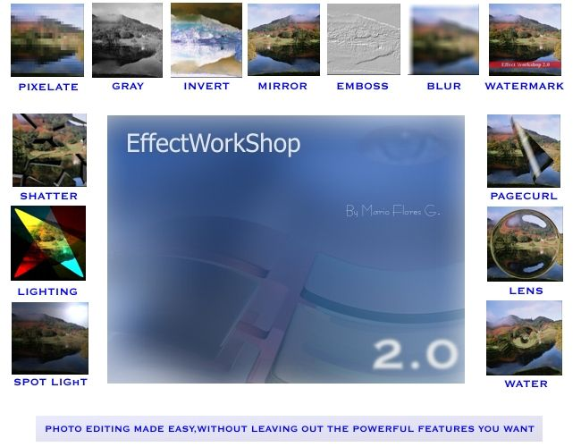

<div align="center">

## EffectWorkShop 2\.0 \(Update 2\.0\.1\)


</div>

### Description

Image-DHTML Editor>>>>> New and Easy GUI lets user get more control of the App, CorelDraw-Photoshop view,a more Pro Software with some new few tricks and functions that can be easy to use and understand, still working on it to finish it,but it will be ready in a few months,still needs better help and guide and needs to be bug free,but here is the beta version ...some of the functions may not be coded yet .if you want to help or got any idea's please send me your code or changes you have made...<<<<Enjoy this Free Version>>>

Download the zip File from the Link Below:

http://www.geocities.com/al99110409/EffectWorkShop2/EffectWorkShop2.zip

<<<<Little Update Minor Fixes.. + Shadow Enabled !

http://www.geocities.com/al99110409/EffectWorkShop2/EffectWorkShop201.zip
 
### More Info
 


<span>             |<span>
---                |---
**Submitted On**   |
**By**             |[MArio Flores G](https://github.com/Planet-Source-Code/PSCIndex/blob/master/ByAuthor/mario-flores-g.md)
**Level**          |Advanced
**User Rating**    |5.0 (65 globes from 13 users)
**Compatibility**  |VB 6\.0, VB Script
**Category**       |[Complete Applications](https://github.com/Planet-Source-Code/PSCIndex/blob/master/ByCategory/complete-applications__1-27.md)
**World**          |[Visual Basic](https://github.com/Planet-Source-Code/PSCIndex/blob/master/ByWorld/visual-basic.md)
**Archive File**   |[](https://github.com/Planet-Source-Code/mario-flores-g-effectworkshop-2-0-update-2-0-1__1-47435/archive/master.zip)


### Source Code

```
Here's the Code Enjoy :)
http://www.geocities.com/al99110409/EffectWorkShop2/EffectWorkShop2.zip
<<<<Little Update Minor Fixes.. + Shadow Enabled !
http://www.geocities.com/al99110409/EffectWorkShop2/EffectWorkShop201.zip
```

